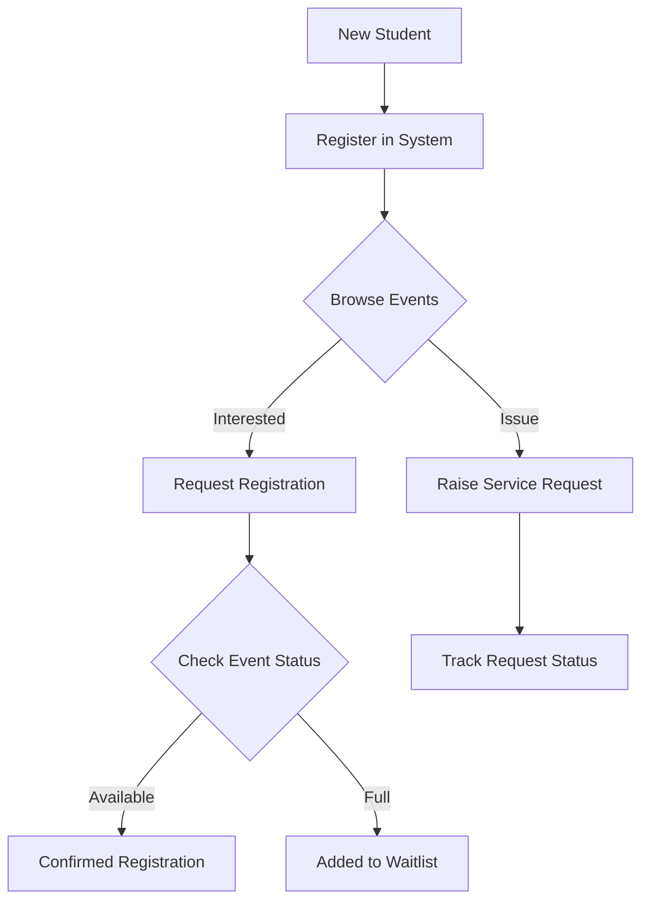
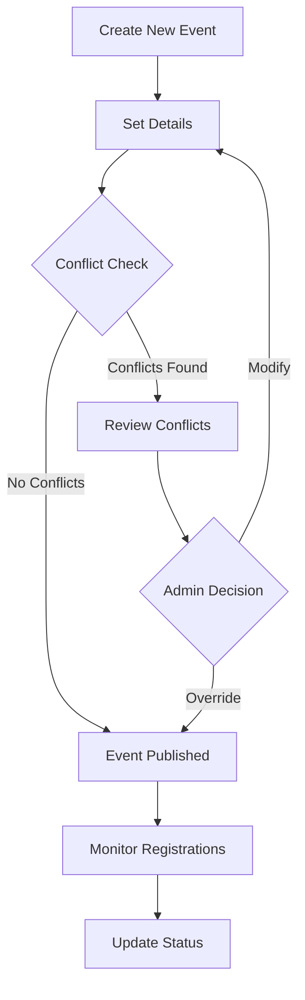
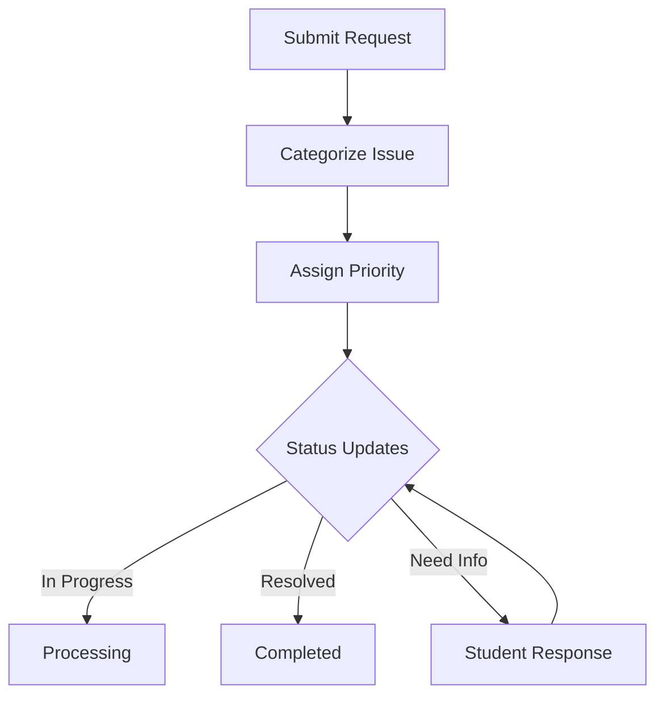
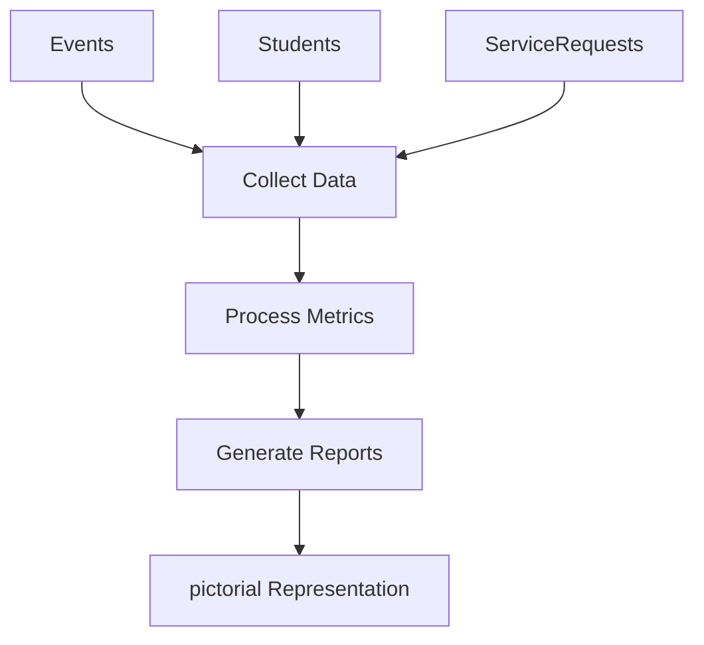

# Campus Event & Student Service Management System

[](https://github.com/0Tarun0709/Campus-Event-Student-Service-Management/actions)
[](https://github.com/0Tarun0709/Campus-Event-Student-Service-Management/actions)
[](https://0tarun0709.github.io/Campus-Event-Student-Service-Management)
[](https://github.com/0Tarun0709/Campus-Event-Student-Service-Management/actions)


## Overview
This system provides a comprehensive solution for managing campus events and student services. It includes both a web-based interface (Streamlit) for managing student registrations, event scheduling, and service requests.

## Features

### 1. Student Management
- Create and manage student profiles
- View student participation in events
- Track service requests by students

### 2. Event Management
- Schedule new campus events
- Automatic conflict detection (time and venue)
- Track event registrations
- Monitor venue utilization
- Validate event schedules

### 3. Service Request System
- Submit and track service requests
- Multiple service categories
- Status tracking (Open, In-Progress, Resolved)

### 4. Registration System
- Manage event registrations
- Automatic waitlist management
- Track confirmed and waitlisted registrations

## Class Structure

### Models

#### 1. Student
- Properties:
  - `student_id`: Unique identifier
  - `name`: Student's name
  - `registrations`: List of event registrations
  - `service_requests`: List of service requests

#### 2. Event
- Properties:
  - `event_id`: Unique identifier
  - `title`: Event name
  - `club`: Organizing club
  - `date`: Event date
  - `start_time`: Event start time
  - `end_time`: Event end time
  - `venue`: Location
  - `max_seats`: Maximum capacity
  - `registrations`: List of registrations
  - `is_valid`: Schedule validity flag
  - `violations`: List of scheduling violations
- Methods:
  - `get_datetime_range()`: Get event's time range
  - `get_conflict_details()`: Check conflicts with other events
  - `has_conflict_with()`: Determine if events conflict
  - `get_summary()`: Get event summary

#### 3. Registration
- Properties:
  - `student`: Associated student
  - `event`: Associated event
  - `status`: Registration status (Confirmed/Waitlisted)

#### 4. ServiceRequest
- Properties:
  - `request_id`: Unique identifier
  - `student`: Requesting student
  - `category`: Service category
  - `status`: Request status
  - `created_at`: Timestamp

## Application Flow

### Student Journey

This flow represents how a student interacts with the system — from registering as a new student, browsing available events, registering for events (with confirmed/waitlist logic), and raising service requests when needed.


### Event Creation & Management
This flow illustrates how clubs/departments create events, set details, and go through conflict detection (time and venue). If conflicts arise, It Shows a Pop-up giving a User a chance to modify for confilcts  Published events are then monitored for registrations and updated as needed.

### Service Request Workflow

This workflow explains how students raise service requests. The system categorizes and prioritizes issues, tracks status updates, and manages resolution. Requests can be marked as In Progress, Resolved, or require further information from the student.

### 4️⃣ System Analytics

This flow represents how the system gathers data from events and service requests, processes it into useful metrics, generates reports, and identifies patterns, which further represntated in the Pictorial Charts.



## Streamlit Application Components


### Streamlit application (`app.py`)
- streamlit-based web UI
- Interactive dashboard
- refer the doc string of each function of more details.

### 1. Dashboard Tab (`dashboard.py`)
- Real-time key statistics display
- Event status overview with interactive charts
- Registration metrics visualization
- System-wide performance indicators

### 2. Events Tab (`events.py`)
- Comprehensive event creation interface
- Automatic conflict detection and warning system
- Event listing with detailed information
- Registration status tracking
- Venue and time management

### 3. Students Tab (`students.py`)
- Student registration and management
- Detailed student profiles
- Event participation tracking
- Registration status monitoring
- Interactive student data display

### 4. Service Requests Tab (`requests.py`)
- Service request submission interface
- Real-time status updates
- Category-based request management
- Request tracking and monitoring
- Status workflow management (Open → In-Progress → Resolved)

### 5. Analytics Tab (`analytics.py`)
- Interactive data visualizations
- Event registration analytics
- Venue utilization charts
- Service request analysis
- Category distribution insights
- Status distribution tracking

## Setup and Installation

### Prerequisites
- Python 3.11+ (project supports 3.13)
- Git for cloning the repository

### Quick Start

1. **Clone the repository**
   ```bash
   git clone https://github.com/0Tarun0709/Campus-Event-Student-Service-Management.git
   cd Campus-Event-Student-Service-Management
   ```

2. **Environment Setup**
   ```bash
   python -m venv .venv
   source .venv/bin/activate  # On Unix/macOS
   # or
   .\.venv\Scripts\activate  # On Windows
   ```

3. **Install Dependencies**
   ```bash
   # Using uv (recommended - faster installation)
   uv pip install -e ".[dev]"
   
   # Or using pip
   pip install -r requirements.txt
   
   # For development dependencies
   pip install -r requirements-dev.txt
   ```

4. **Run the Application**
   ```bash
   streamlit run app.py
   ```

5. **Access the Application**
   Open your browser to `http://localhost:8501`

### Alternative Setup Methods

**Using Make (if available):**
```bash
make setup-dev    # Set up development environment
make run         # Run the application
make test        # Run tests
```

**Using the setup script:**
```bash
./setup-dev.sh  # Automated development setup
```


## Project Structure
```
Covalence/
├── tabs/                   # Steamlit application tabs
│   ├── analytics.py        # Analytics and reporting functionalities
│   ├── dashboard.py        # Main dashboard view
│   ├── events.py           # Event management logic and UI
│   ├── requests.py         # Service request handling
│   └── students.py         # Student profiles and registration
└── data/                  
    └── data.py             # Consists of the sample data
├── app.py                  # Streamlit app entry point
├── models.py               # Data models and classes
├── main.py                 # Management calss implementation
├── requirements.txt        # Dependencies
├── README.md               # Documentation overview, setup instructions
└── tests/                  
    ├── test.py             # test phase 1
    └── test2.py            # tests phase 2

```

## Implementation Details

### Dashboard Features
- Real-time metrics using Streamlit metrics component
- Interactive charts using Plotly Express
- Dynamic data updates using session state
- Comprehensive system overview

### Event Management System
1. Conflict Detection
   - Automatic time overlap checking
   - Venue conflict detection

2. Registration System
   - Automatic capacity management
   - Waitlist handling
   - Status tracking (Confirmed/Waitlisted)

### Student Management
1. Profile Management
   - Basic information tracking
   - Event participation history
   - Service request history
   - Request status tracking

2. Interactive Features
   - Dynamic student selection
   - Real-time updates
   - Detailed student views
   - Service Request management

### Service Request System
1. Request Lifecycle
   - Submission interface
   - Status tracking (Open/In-Progress/Resolved)
   - Category management
   - Timestamp tracking

2. Management Interface
   - Status updates
   - Visual status indicators
   - Student association

### Analytics and Reporting
1. Event Analytics
   - Venue utilization
   - Capacity analysis
   - Conflict statistics

2. Service Request Analytics
   - Status distribution
   - Category analysis
   - Response time metrics
   - Trend analysis

## Testing

### Running Tests
```bash
# Run all tests
pytest

# Run with coverage
pytest --cov=. --cov-report=html

# Run specific test categories
pytest tests/test_system.py        # Core system tests
pytest tests/test_integration.py   # Streamlit integration tests
pytest tests/test_main_system.py   # Management system tests

# Run performance benchmarks
pytest --benchmark-only

# Generate coverage report
pytest --cov=. --cov-report=html
open htmlcov/index.html  # View coverage report
```

### Test Coverage
The project includes:
- **Unit tests** for core functionality (models, data handling)
- **Integration tests** for Streamlit components
- **System tests** for end-to-end workflows
- **Performance benchmarks** for critical operations
- **Security tests** via bandit and safety

### Quality Assurance
```bash
# Run all quality checks
make qa

# Individual tools
black .           # Code formatting
isort .          # Import sorting
flake8 .         # Linting
mypy .           # Type checking
pylint **/*.py   # Advanced linting
bandit -r .      # Security scanning
safety check     # Dependency vulnerability check
```

## Documentation

- 📚 **[Full Documentation](https://0tarun0709.github.io/Campus-Event-Student-Service-Management)** - Complete project documentation
- 🚀 **[Getting Started Guide](docs/getting-started.md)** - Step-by-step setup instructions  
- 🔧 **[Development Setup](docs/development/setup.md)** - Development environment configuration
- 📋 **[CI/CD Pipeline](docs/ci-cd/overview.md)** - Continuous integration and deployment
- 🎯 **[UV Usage Guide](docs/legacy-md/UV-CHEATSHEET.md)** - Fast Python package management
- 📊 **[API Documentation](docs/api/)** - Code API reference

## Health Monitoring

The application includes built-in health monitoring:

- **Health Check Endpoint**: Access `/healthz` for system status
- **System Metrics**: CPU, memory, and disk usage monitoring  
- **Application State**: Component health and connectivity checks
- **Performance Monitoring**: Response time and throughput metrics

## Environment Variables

Create a `.env` file for local development:

```bash
# Application Configuration
STREAMLIT_SERVER_PORT=8501
STREAMLIT_SERVER_ADDRESS=0.0.0.0

# Development Settings
DEBUG=True
LOG_LEVEL=INFO

# Health Check Configuration  
HEALTH_CHECK_TIMEOUT=30
```

## Contributing

We welcome contributions! Here's how to get started:

1. **Fork the repository**
2. **Create a feature branch**
   ```bash
   git checkout -b feature/amazing-feature
   ```
3. **Make your changes**
   - Follow the existing code style
   - Add tests for new functionality
   - Update documentation as needed
4. **Run quality checks**
   ```bash
   make qa          # Run all checks
   pytest           # Run tests
   ```
5. **Commit your changes**
   ```bash
   git commit -m 'Add amazing feature'
   ```
6. **Push to your branch**
   ```bash
   git push origin feature/amazing-feature
   ```
7. **Open a Pull Request**

### Development Guidelines

- **Code Style**: Use Black for formatting, follow PEP 8
- **Testing**: Maintain >80% test coverage
- **Documentation**: Update docs for any API changes
- **Security**: Run security scans before submitting
- **Performance**: Consider impact on application performance

See **[Contributing Guidelines](docs/development/contributing.md)** for detailed information.

## Deployment

### Streamlit Cloud (Recommended)
1. Connect your GitHub repository to Streamlit Cloud
2. Set the main file to `app.py`  
3. Configure environment variables if needed
4. Deploy automatically on push to main branch

### Docker Deployment
```bash
# Build the container
docker build -t campus-management .

# Run the container  
docker run -p 8501:8501 campus-management

# Or use Docker Compose
docker-compose up
```

### Manual Deployment
```bash
# On your server
git clone <repository-url>
cd Campus-Event-Student-Service-Management
pip install -r requirements.txt
streamlit run app.py --server.port 8501 --server.address 0.0.0.0
```

## Architecture

The system follows a modular architecture:

```
┌─────────────────┐    ┌──────────────────┐    ┌─────────────────┐
│   Streamlit UI  │────│  Business Logic  │────│   Data Models   │
│   (Frontend)    │    │   (Controllers)  │    │   (Backend)     │
└─────────────────┘    └──────────────────┘    └─────────────────┘
         │                        │                        │
         ▼                        ▼                        ▼
┌─────────────────┐    ┌──────────────────┐    ┌─────────────────┐
│  Tab Components │    │ Event Management │    │ Student/Event   │
│  (dashboard,    │    │ Service Requests │    │ Registration    │
│   events, etc.) │    │ Analytics Engine │    │ Models          │
└─────────────────┘    └──────────────────┘    └─────────────────┘
```

## License

This project is licensed under the **MIT License** - see the [LICENSE](LICENSE) file for details.

## Support

- 📧 **Email**: mushamsaitarun328@gmail.com
- 🐛 **Issues**: [GitHub Issues](https://github.com/0Tarun0709/Campus-Event-Student-Service-Management/issues)
- 📖 **Documentation**: [Project Docs](https://0tarun0709.github.io/Campus-Event-Student-Service-Management)
- 💬 **Discussions**: [GitHub Discussions](https://github.com/0Tarun0709/Campus-Event-Student-Service-Management/discussions)

## Acknowledgments

- **Streamlit** - For the amazing web framework
- **Plotly** - For interactive visualizations
- **Python Community** - For excellent tooling and libraries

---

**Made with ❤️ for educational institutions**

*Last Updated: October 2025*
