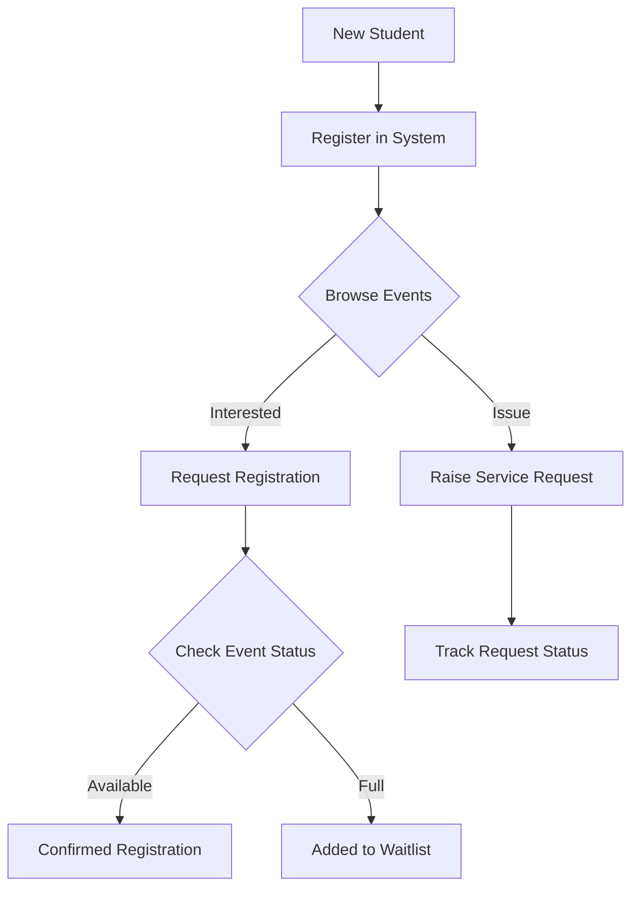
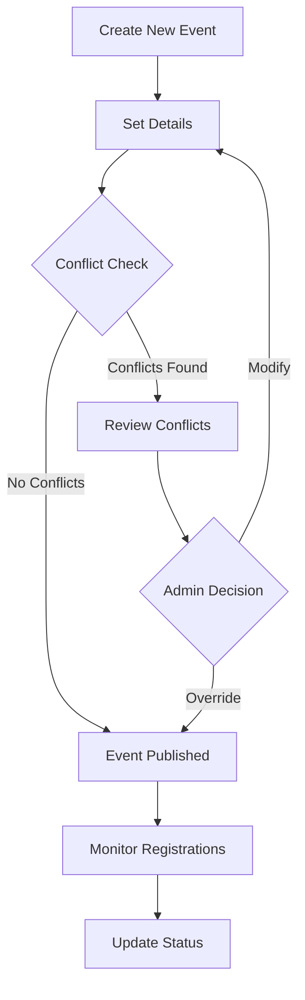
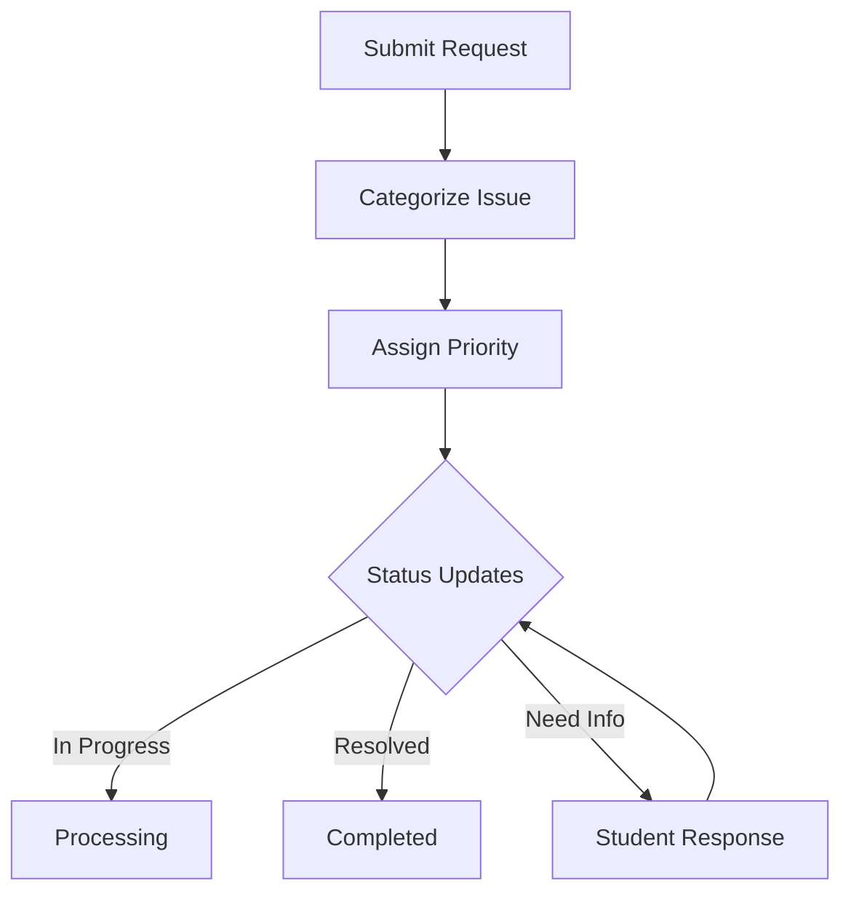
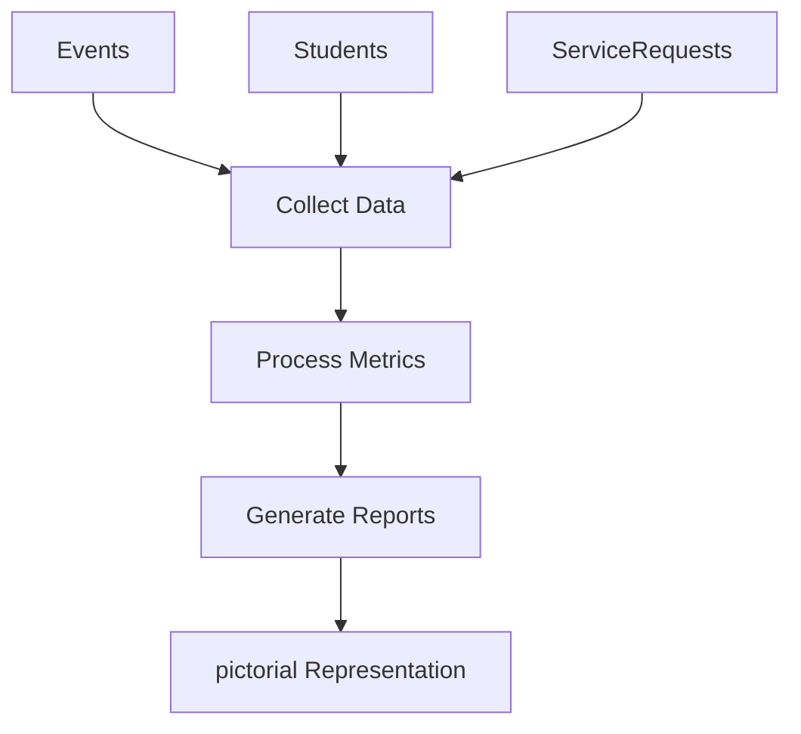

# Campus Event & Student Service Management System

## Overview
This system provides a comprehensive solution for managing campus events and student services. It includes both a web-based interface (Streamlit) for managing student registrations, event scheduling, and service requests.

## Features

### 1. Student Management
- Create and manage student profiles
- View student participation in events
- Track service requests by students

### 2. Event Management
- Schedule new campus events
- Automatic conflict detection (time and venue)
- Track event registrations
- Monitor venue utilization
- Validate event schedules

### 3. Service Request System
- Submit and track service requests
- Multiple service categories
- Status tracking (Open, In-Progress, Resolved)

### 4. Registration System
- Manage event registrations
- Automatic waitlist management
- Track confirmed and waitlisted registrations

## Class Structure

### Models

#### 1. Student
- Properties:
  - `student_id`: Unique identifier
  - `name`: Student's name
  - `registrations`: List of event registrations
  - `service_requests`: List of service requests

#### 2. Event
- Properties:
  - `event_id`: Unique identifier
  - `title`: Event name
  - `club`: Organizing club
  - `date`: Event date
  - `start_time`: Event start time
  - `end_time`: Event end time
  - `venue`: Location
  - `max_seats`: Maximum capacity
  - `registrations`: List of registrations
  - `is_valid`: Schedule validity flag
  - `violations`: List of scheduling violations
- Methods:
  - `get_datetime_range()`: Get event's time range
  - `get_conflict_details()`: Check conflicts with other events
  - `has_conflict_with()`: Determine if events conflict
  - `get_summary()`: Get event summary

#### 3. Registration
- Properties:
  - `student`: Associated student
  - `event`: Associated event
  - `status`: Registration status (Confirmed/Waitlisted)

#### 4. ServiceRequest
- Properties:
  - `request_id`: Unique identifier
  - `student`: Requesting student
  - `category`: Service category
  - `status`: Request status
  - `created_at`: Timestamp

## Application Flow

### Student Journey

This flow represents how a student interacts with the system — from registering as a new student, browsing available events, registering for events (with confirmed/waitlist logic), and raising service requests when needed.


### Event Creation & Management
This flow illustrates how clubs/departments create events, set details, and go through conflict detection (time and venue). If conflicts arise, It Shows a Pop-up giving a User a chance to modify for confilcts  Published events are then monitored for registrations and updated as needed.

### Service Request Workflow

This workflow explains how students raise service requests. The system categorizes and prioritizes issues, tracks status updates, and manages resolution. Requests can be marked as In Progress, Resolved, or require further information from the student.

### 4️⃣ System Analytics

This flow represents how the system gathers data from events and service requests, processes it into useful metrics, generates reports, and identifies patterns, which further represntated in the Pictorial Charts.



## Streamlit Application Components


### Streamlit application (`app.py`)
- streamlit-based web UI
- Interactive dashboard
- refer the doc string of each function of more details.

### 1. Dashboard Tab (`dashboard.py`)
- Real-time key statistics display
- Event status overview with interactive charts
- Registration metrics visualization
- System-wide performance indicators

### 2. Events Tab (`events.py`)
- Comprehensive event creation interface
- Automatic conflict detection and warning system
- Event listing with detailed information
- Registration status tracking
- Venue and time management

### 3. Students Tab (`students.py`)
- Student registration and management
- Detailed student profiles
- Event participation tracking
- Registration status monitoring
- Interactive student data display

### 4. Service Requests Tab (`requests.py`)
- Service request submission interface
- Real-time status updates
- Category-based request management
- Request tracking and monitoring
- Status workflow management (Open → In-Progress → Resolved)

### 5. Analytics Tab (`analytics.py`)
- Interactive data visualizations
- Event registration analytics
- Venue utilization charts
- Service request analysis
- Category distribution insights
- Status distribution tracking

## Setup and Installation

1. **Environment Setup**
   ```bash
   python -m venv venv
   source venv/bin/activate  # On Unix/macOS
   # or
   .\venv\Scripts\activate  # On Windows
   ```

2. **Install Dependencies**
   ```bash
   pip install -r requirements.txt
   ```

3. **Running the Applications**
   
   
   Web Application:
   ```bash
   streamlit run app.py
   ```


## Project Structure
```
Covalence/
├── tabs/                   # Steamlit application tabs
│   ├── analytics.py        # Analytics and reporting functionalities
│   ├── dashboard.py        # Main dashboard view
│   ├── events.py           # Event management logic and UI
│   ├── requests.py         # Service request handling
│   └── students.py         # Student profiles and registration
└── data/                  
    └── data.py             # Consists of the sample data
├── app.py                  # Streamlit app entry point
├── models.py               # Data models and classes
├── main.py                 # Management calss implementation
├── requirements.txt        # Dependencies
├── README.md               # Documentation overview, setup instructions
└── tests/                  
    ├── test.py             # test phase 1
    └── test2.py            # tests phase 2

```

## Implementation Details

### Dashboard Features
- Real-time metrics using Streamlit metrics component
- Interactive charts using Plotly Express
- Dynamic data updates using session state
- Comprehensive system overview

### Event Management System
1. Conflict Detection
   - Automatic time overlap checking
   - Venue conflict detection

2. Registration System
   - Automatic capacity management
   - Waitlist handling
   - Status tracking (Confirmed/Waitlisted)

### Student Management
1. Profile Management
   - Basic information tracking
   - Event participation history
   - Service request history
   - Request status tracking

2. Interactive Features
   - Dynamic student selection
   - Real-time updates
   - Detailed student views
   - Service Request management

### Service Request System
1. Request Lifecycle
   - Submission interface
   - Status tracking (Open/In-Progress/Resolved)
   - Category management
   - Timestamp tracking

2. Management Interface
   - Status updates
   - Visual status indicators
   - Student association

### Analytics and Reporting
1. Event Analytics

   - Venue utilization
   - Capacity analysis
   - Conflict statistics

2. Service Request Analytics
   - Status distribution
   - Category analysis
   - Response time metrics
   - Trend analysis
