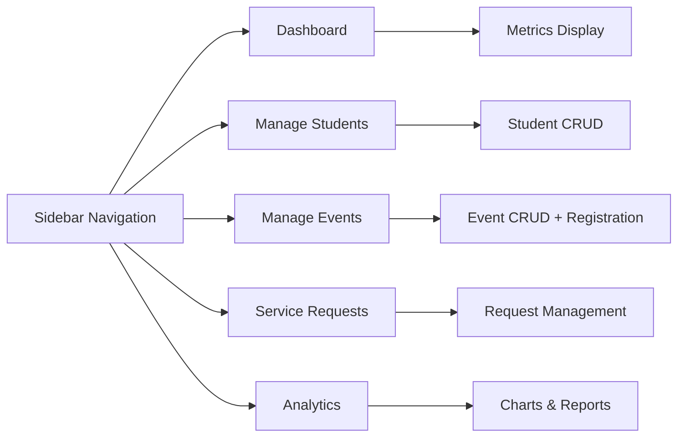

# Quick Start Guide

Get the Campus Event & Student Service Management System running in minutes!

## 🚀 Launch in 3 Steps

### Step 1: Get the Code
```bash
git clone https://github.com/0Tarun0709/Campus-Event-Student-Service-Management.git
cd Campus-Event-Student-Service-Management
```

### Step 2: Setup Environment
```bash
./setup-dev.sh
```

### Step 3: Run the App
```bash
make run
```

That's it! The application will open at `http://localhost:8501` 🎉

## 🎯 First Use Walkthrough

### 1. Dashboard Overview
When you first open the application, you'll see the Dashboard with:

- **Student Count**: Total registered students
- **Event Count**: Scheduled events
- **Registration Metrics**: Event participation data
- **Service Request Stats**: Pending and resolved requests

### 2. Add Your First Student

1. Navigate to **"Manage Students"** in the sidebar
2. Fill in the student information:
   - **Student ID**: Unique identifier (e.g., "STU001")
   - **Name**: Full name
   - **Email**: Contact email
   - **Major**: Field of study
3. Click **"Add Student"**

!!! tip "Pro Tip"
    Use a consistent ID format like "STU001", "STU002" for easy management.

### 3. Create Your First Event

1. Go to **"Manage Events"**
2. Enter event details:
   - **Event ID**: Unique identifier (e.g., "EVT001")
   - **Title**: Event name
   - **Club**: Organizing club/department
   - **Date**: Event date (YYYY-MM-DD format)
   - **Start/End Time**: Time range
   - **Venue**: Location
   - **Max Seats**: Capacity limit
3. Click **"Add Event"**

!!! warning "Conflict Detection"
    The system automatically checks for venue and time conflicts!

### 4. Register Students for Events

1. In **"Manage Events"**, find your event
2. Use the registration section
3. Enter the Student ID
4. Click **"Register Student"**

The system will:
- ✅ Validate student exists
- ✅ Check for duplicates
- ✅ Manage waitlists if full

### 5. Track Service Requests

1. Navigate to **"Manage Service Requests"**
2. Create a new request:
   - **Student ID**: Requesting student
   - **Service Type**: Category (IT Support, Library Access, etc.)
   - **Description**: Detailed request
   - **Priority**: High, Medium, or Low
3. Monitor status changes

## 📊 Sample Data Walkthrough

Let's create some sample data to explore features:

=== "Students"
    ```
    STU001 | Alice Johnson    | alice@college.edu    | Computer Science
    STU002 | Bob Smith        | bob@college.edu      | Mathematics  
    STU003 | Carol Williams   | carol@college.edu    | Physics
    STU004 | David Brown      | david@college.edu    | Engineering
    ```

=== "Events"
    ```
    EVT001 | AI Workshop      | Tech Club     | 2025-11-15 | 10:00-12:00 | Lab A | 25
    EVT002 | Math Symposium   | Math Society  | 2025-11-16 | 14:00-16:00 | Hall B | 100
    EVT003 | Career Fair      | Career Center | 2025-11-20 | 09:00-17:00 | Gym | 200
    ```

=== "Service Requests"
    ```
    STU001 | IT Support       | Laptop repair needed        | High
    STU002 | Library Access   | Need extended hours pass    | Medium
    STU003 | Academic Advising| Course selection help       | Low
    ```

## 🔧 Common Operations

### View Analytics
1. Go to **"Reports & Analytics"**
2. Explore:
   - Event participation trends
   - Student engagement metrics
   - Service request patterns
   - Popular events and venues

### Export Data
1. In any management tab, look for export options
2. Download data as CSV or Excel
3. Use for external reporting or backup

### Manage Registrations
- **View Registrations**: See who's registered for each event
- **Cancel Registration**: Remove students from events
- **Waitlist Management**: Handle overbooked events

## ⚙️ Configuration Tips

### Environment Settings
Create `.env` file for customization:
```bash
# Application Settings
STREAMLIT_SERVER_PORT=8501
DEBUG=true

# Feature Flags
ENABLE_ANALYTICS=true
ENABLE_EXPORT=true
```

### Sample Data Loading
Load sample data quickly:
```python
# In the Streamlit app, use the sample data loader
# Available in the sidebar: "Load Sample Data"
```

## 🚨 Troubleshooting

### App Won't Start?
```bash
# Check Python version
python --version  # Should be 3.11+

# Reinstall dependencies
make install-dev

# Check for errors
make test
```

### Port Already in Use?
```bash
# Use different port
streamlit run app.py --server.port 8502
```

### Import Errors?
```bash
# Ensure virtual environment is activated
source .venv/bin/activate

# Reinstall in development mode
pip install -e .
```

## 📱 Interface Overview



## 🎯 Next Steps

Now that you're up and running:

1. **[Configuration Guide](configuration.md)** - Customize the system
2. **[User Guide](../user-guide/students.md)** - Detailed feature documentation
3. **[Development Setup](../development/setup.md)** - If you want to contribute
4. **[CI/CD Guide](../ci-cd/overview.md)** - Learn about our automation

## 💡 Pro Tips

!!! success "Keyboard Shortcuts"
    - `Ctrl+R` - Refresh the Streamlit app
    - Use browser bookmarks for direct tab access
    - Keep the browser developer tools open for debugging

!!! info "Best Practices"
    - Use consistent ID formats (STU001, EVT001, etc.)
    - Regular backups via export functionality
    - Monitor the Analytics dashboard for insights
    - Set up proper venue capacity limits

!!! warning "Common Gotchas"
    - Date format must be YYYY-MM-DD
    - Student IDs are case-sensitive
    - Venue conflicts prevent event creation
    - Check browser console for JavaScript errors

Ready to dive deeper? Check out our [detailed user guides](../user-guide/students.md)!